# Workshop Booking - Reimagined

A modern redesign of the [FOSSEE Workshop Booking](https://github.com/FOSSEE/workshop_booking) portal. The original site was a Django 1.10 monolith with Bootstrap 4, jQuery, and server-rendered templates. This version separates the frontend into a React SPA and adds a Django REST API layer, while upgrading the backend to Django 5.2 LTS.

## Visual Comparison

### Home Page
| Desktop | Mobile |
|---------|--------|
| 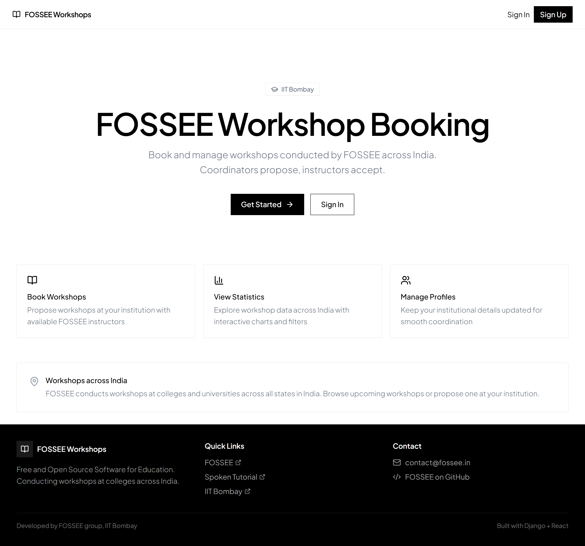 | _(pending: old version)_ |
| _(pending: reimagined)_ |  |

### Login
| Desktop | Mobile |
|---------|--------|
| 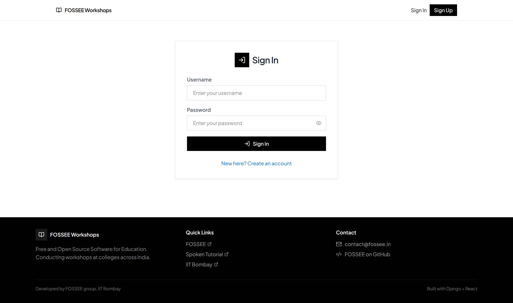 | _(pending: old version)_ |
| _(pending: reimagined)_ | 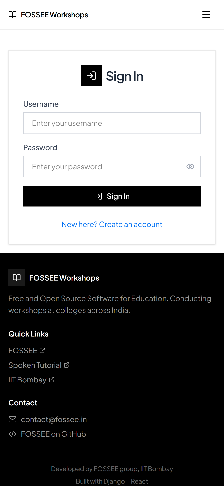 |

### Registration
| Desktop | Mobile |
|---------|--------|
| 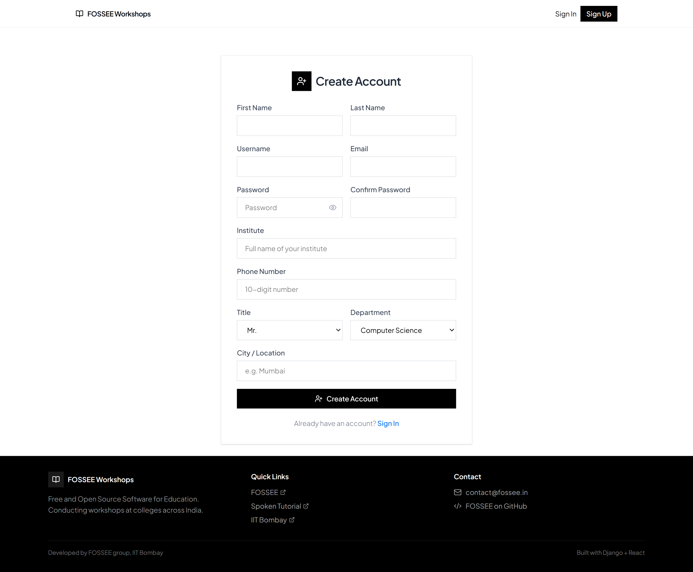 | _(pending: old version)_ |
| _(pending: reimagined)_ | 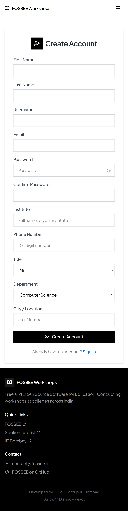 |

### Dashboard
| Desktop | Mobile |
|---------|--------|
| 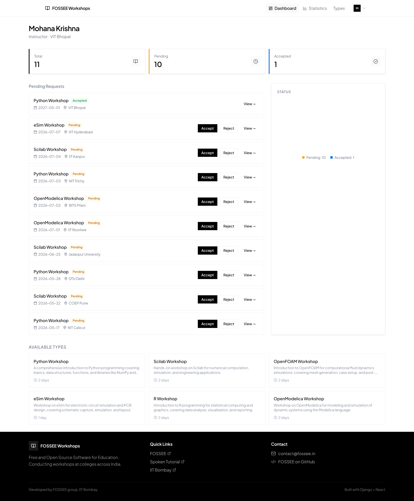 | _(pending: old version)_ |
| _(pending: reimagined)_ | 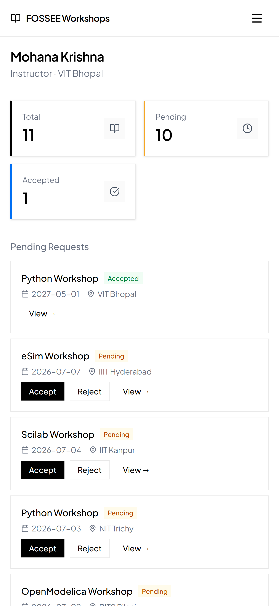 |

### Statistics
| Desktop | Mobile |
|---------|--------|
| 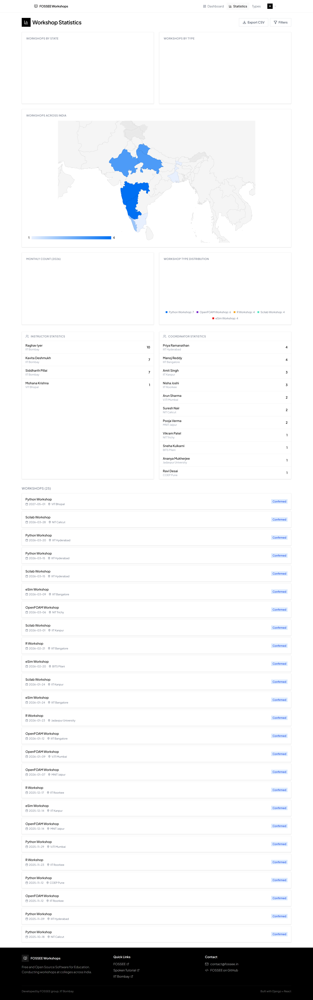 | _(pending: old version)_ |
| _(pending: reimagined)_ | 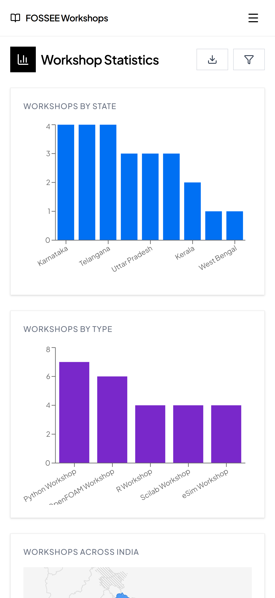 |

### Workshop Types
| Desktop | Mobile |
|---------|--------|
| 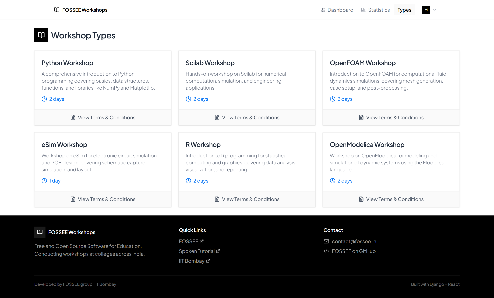 | _(pending: old version)_ |
| _(pending: reimagined)_ | 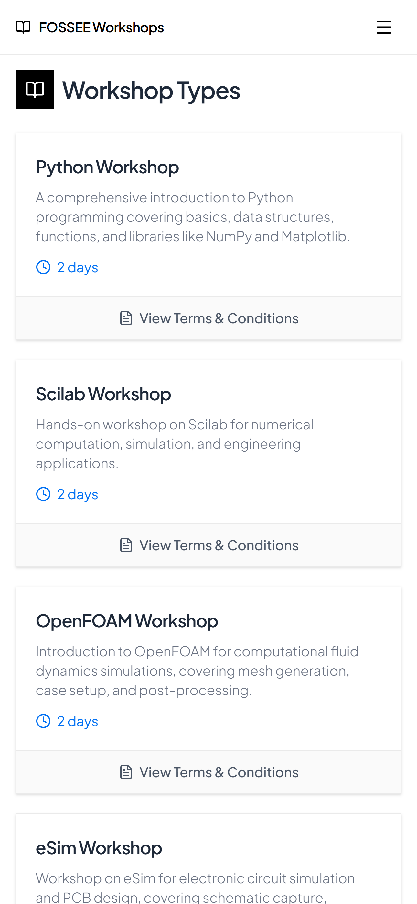 |

### Profile
| Desktop | Mobile |
|---------|--------|
| 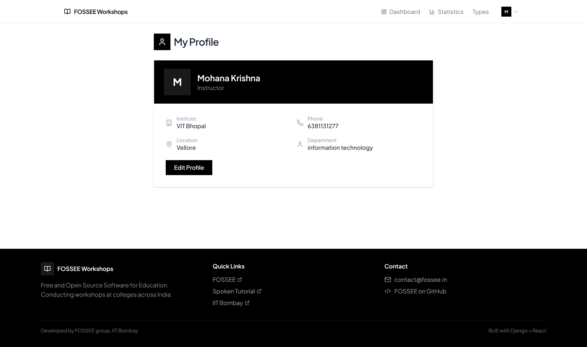 | _(pending: old version)_ |
| _(pending: reimagined)_ | 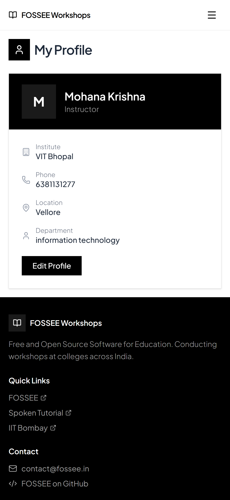 |

---

## Design Principles

**Vercel-inspired minimalism:** The original site used Bootstrap's default blue theme with rounded corners and heavy gradients — a look that immediately reads as "Bootstrap template." I replaced it with a black-and-white neutral palette, sharp borders, and Plus Jakarta Sans at weights 300/400/500/600. No decorative elements. The color comes from content — chart fills, status indicators, and accent blue (#0070f3) for interactive elements.

**Mobile-first approach:** The original site used Bootstrap tables for all data display, which required horizontal scrolling on mobile. I replaced tables with card-based layouts that stack vertically on small screens. Touch targets are at least 44px, form inputs use native `type="date"` instead of jQuery UI datepicker, and the navbar collapses into a hamburger menu.

**Progressive disclosure:** Instead of showing everything at once (the old statistics page loaded all data, filters, and charts in one dense view), I use collapsible filter panels, expandable T&C sections on workshop type cards, and skeleton loading states that reveal content progressively.

**Skeleton loading over spinners:** Rather than a single spinner for the entire page, I built skeleton components that mirror the layout of the actual content. This gives users a preview of what's coming and makes the load feel faster — the same pattern used by YouTube, LinkedIn, and Facebook.

## Responsiveness

The original site was not responsive — it relied on Bootstrap's `col-md-*` grid which only adapted at the 768px breakpoint, and data tables broke on phones.

Key responsive changes:
- **Card layouts over tables** — Workshop lists use flex cards that stack on mobile instead of horizontal-scroll tables
- **Collapsible navbar** — Full hamburger menu on mobile with touch-friendly 48px tap targets
- **Responsive forms** — Registration uses single-column on mobile, two-column on desktop
- **Responsive charts** — Recharts `ResponsiveContainer` adapts to viewport width instead of the old fixed 900px jQuery dialog
- **Touch-friendly inputs** — Native HTML5 date picker instead of jQuery UI, larger button sizes

## Roles & Permissions

The system has two user roles, matching the original project's design:

| Role | How assigned | Capabilities |
|------|-------------|-------------|
| **Coordinator** | Default on registration | Propose workshops, view own workshops, edit profile, view statistics |
| **Instructor** | Promoted by admin via admin panel | Accept/reject workshops, view all pending, add/edit workshop types |
| **Admin** | Django superuser | Full admin panel access: manage users, promote roles, manage workshop types, create workshops |

Coordinators register and propose workshops at their institution. Instructors review and accept/reject proposals. Admins manage the system — promoting coordinators to instructors, adding workshop types, and overseeing all activity.

## Trade-offs Between Design and Performance

**Tailwind CSS vs. smaller CSS:** Tailwind generates more class names in markup, but the production build uses purging — the final CSS is only 27KB (5.7KB gzipped). This is actually smaller than the old Bootstrap + custom CSS bundle.

**Recharts vs. raw Chart.js:** Recharts adds ~100KB to the Statistics chunk but provides React-native declarative chart syntax. Since it's code-split (lazy loaded), users only download it when visiting the Statistics page. The original site loaded Chart.js on every page even if you never visited stats.

**Session auth vs. JWT:** I chose Django's built-in session authentication over JWT tokens. Session auth is simpler, works natively with Django's CSRF protection, and is sufficient for a same-origin SPA. The trade-off is that if a future mobile app needs the API, JWT would be better — but the task specifies students accessing via browsers on mobile devices.

**Skeleton loading vs. simpler spinners:** Skeletons add ~2KB of component code but significantly improve perceived performance. The trade-off is maintainability — when the page layout changes, the skeleton must be updated too. I mitigated this by creating reusable skeleton primitives (`SkeletonStatCard`, `SkeletonRow`, `SkeletonChart`) that match the component structure.

## Most Challenging Part

The hardest part was bridging the gap between Django's server-rendered template architecture and a React SPA. The original site used Django's `@login_required` decorators, form validation with `forms.py`, and template-level conditional rendering (e.g., showing instructor vs. coordinator content). I had to:

1. **Create a complete DRF API layer** — The original had no API endpoints. I built serializers and views that expose the same data the templates rendered server-side, including nested data like workshop comments with visibility rules (instructors see all comments, coordinators only see public ones).

2. **Handle CSRF with session auth** — Django's CSRF protection doesn't work out-of-the-box with a separate dev server. I created a custom `CsrfExemptSessionAuthentication` class that skips DRF's CSRF enforcement while keeping the SPA protected by CORS, SameSite cookies, and session auth.

3. **Replicate permission logic on the client** — The old templates used `` to conditionally render UI. I expose `is_instructor` and `is_admin` from the API's `/auth/me/` endpoint and use it in React components to show/hide the Propose button, accept/reject buttons, admin panel access, and comment visibility.

---

## Setup

### Prerequisites
- Python 3.10+
- Node.js 18+
- npm

### Backend
```bash
cd backend
python -m venv venv
venv\Scripts\activate        # Windows
source venv/bin/activate     # macOS/Linux
pip install -r requirements.txt
python manage.py migrate
python manage.py createsuperuser
python manage.py seed_workshop_types  # Create 6 workshop types
python manage.py seed_data            # Optional: load sample data (41 workshops, 18 users)
python manage.py runserver
```

The backend runs on `http://127.0.0.1:8000`

### Frontend
```bash
cd frontend
npm install
npm run dev
```

The frontend runs on `http://localhost:5173` and proxies `/api` requests to the Django backend via Vite's proxy configuration.

### Production Build
```bash
cd frontend
npm run build
```

The built files go to `frontend/dist/` which can be served by Django with `collectstatic`.

---

## Tech Stack

| Layer | Technology |
|-------|-----------|
| Frontend | React 18, Vite, Tailwind CSS v4 |
| Routing | React Router v6 (lazy loaded) |
| State | React Context (auth), component state |
| API Client | Axios with CSRF interceptors |
| Charts | Recharts (code-split) |
| Icons | Lucide React |
| Font | Plus Jakarta Sans |
| Backend | Django 5.2 LTS, Django REST Framework |
| Auth | Django session auth + CORS |

## API Endpoints

All endpoints are prefixed with `/api/`.

### Authentication

| Method | Endpoint | Auth | Description |
|--------|----------|------|-------------|
| `GET` | `/api/auth/csrf-token/` | Public | Returns CSRF token cookie |
| `POST` | `/api/auth/register/` | Public | Register new coordinator account |
| `POST` | `/api/auth/login/` | Public | Login with username/password |
| `POST` | `/api/auth/logout/` | Required | Logout current session |
| `GET` | `/api/auth/me/` | Required | Get current user (includes `is_instructor`, `is_admin`) |
| `GET` | `/api/auth/activate/<key>/` | Public | Activate account via email link |

### Workshops

| Method | Endpoint | Auth | Description |
|--------|----------|------|-------------|
| `GET` | `/api/workshops/coordinator/` | Coordinator | List coordinator's own workshops |
| `GET` | `/api/workshops/instructor/` | Instructor | List instructor's workshops + pending |
| `POST` | `/api/workshops/propose/` | Coordinator | Propose a new workshop |
| `GET` | `/api/workshops/<pk>/` | Required | Get workshop details + comments |
| `POST` | `/api/workshops/<pk>/accept/` | Instructor | Accept a workshop proposal |
| `POST` | `/api/workshops/<pk>/reject/` | Instructor | Reject a workshop proposal |
| `POST` | `/api/workshops/<pk>/change-date/` | Instructor | Reschedule a workshop |
| `POST` | `/api/workshops/<workshop_id>/comments/` | Required | Add a comment to a workshop |

### Workshop Types

| Method | Endpoint | Auth | Description |
|--------|----------|------|-------------|
| `GET` | `/api/workshop-types/` | Public | List all workshop types |
| `GET` | `/api/workshop-types/<pk>/` | Public | Get workshop type details + T&C |
| `POST` | `/api/workshop-types/create/` | Instructor | Create a new workshop type |
| `PUT` | `/api/workshop-types/<pk>/update/` | Instructor | Update an existing workshop type |

### Statistics

| Method | Endpoint | Auth | Description |
|--------|----------|------|-------------|
| `GET` | `/api/statistics/public/` | Public | Public stats: charts, map data, workshop list |
| `GET` | `/api/statistics/instructor/` | Instructor/Admin | Instructor + coordinator count stats |
| `GET` | `/api/filter-options/` | Public | Dropdown options: states, types, departments, etc. |

Query params for `/api/statistics/public/`: `from_date`, `to_date`, `state`, `workshop_type`, `download` (returns CSV when `?download=1`)

### Profile

| Method | Endpoint | Auth | Description |
|--------|----------|------|-------------|
| `GET` | `/api/profile/` | Required | Get own profile |
| `PUT` | `/api/profile/` | Required | Update own profile |
| `GET` | `/api/profile/<user_id>/` | Required | Get another user's public profile |

### Admin

| Method | Endpoint | Auth | Description |
|--------|----------|------|-------------|
| `GET` | `/api/admin/users/` | Admin | List all users with roles |
| `POST` | `/api/admin/users/<user_id>/promote/` | Admin | Promote user to instructor |
| `POST` | `/api/admin/users/<user_id>/demote/` | Admin | Demote user to coordinator |
| `POST` | `/api/admin/workshops/create/` | Admin | Create a workshop directly |
| `DELETE` | `/api/admin/workshops/<pk>/delete/` | Admin | Delete a workshop |

## Project Structure
```
├── backend/
│   ├── api/                    # DRF serializers, views, urls, auth
│   ├── workshop_app/           # Core Django app (models, views, seed commands)
│   ├── statistics_app/         # Stats & charts
│   ├── teams/                  # Team management
│   ├── cms/                    # Content management
│   ├── workshop_portal/        # Django project settings
│   └── requirements.txt
├── frontend/
│   ├── src/
│   │   ├── api/                # Axios client + endpoint definitions
│   │   ├── components/         # Navbar, Footer, Layout, Skeleton
│   │   ├── context/           # AuthContext
│   │   ├── hooks/             # useMinLoading
│   │   ├── pages/             # All page components
│   │   ├── App.jsx             # Routes with code splitting + ErrorBoundary
│   │   └── main.jsx
│   ├── index.html
│   └── vite.config.js
└── README.md
```
